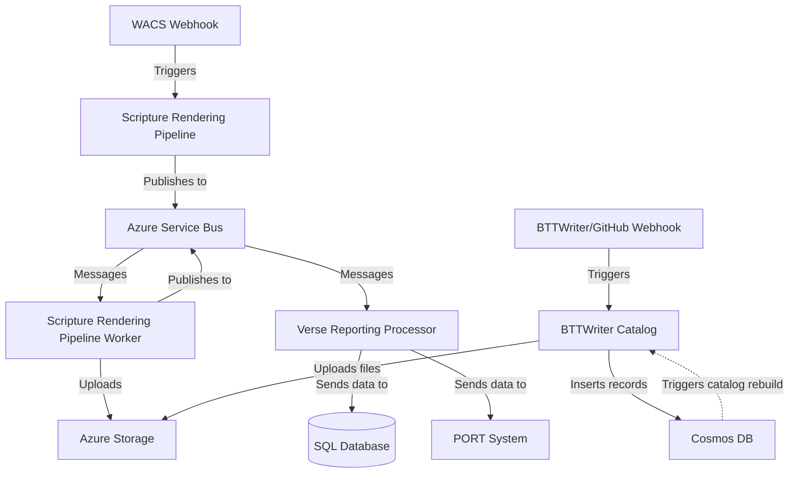

# ScriptureRenderingPipeline
A rendering pipeline for scripture and BTTWriter catalog

## Overview
This application is a pipeline that accepts a webhook and then
 processes the repo into a web page. 
 
 Over time more things have been added on such as webhook handler for
 catalog handling for BTTWriter, verse counting for upload
 statistics, and other things

 ### The Bus
 At the core of the pipeline is the bus, which is an Azure Service bus
 that is responsible for passing events over to various event consumers.
Where everything starts is at the webhook which will receive a webhook from WACS, validate it, and then put it on the bus.

There are several different topics the bus handles, everything either pushes messages onto the bus or subscribes to new messages for a given topic.
Here is the complete list of topics:

| Topic | Description | Producers | Consumers |
|-------|-------------|-----------|-----------|
| WACSEvent | Messages appear here when a webhook is received from WACS | ScriptureRenderingPipeline webhook | RenderingTrigger, ProgressReporting, RepoAnalysisTrigger |
| RepoRendered | Messages appear here when a repo has been rendered | RenderingTrigger | Custom subscribers |
| RepoAnalysisResult | Messages appear here when a repo has been analyzed for type and language | RepoAnalysisTrigger | Custom subscribers |
| VerseCountingResult | Messages appear here when a repo has had its verses counted | ProgressReporting | VerseReportingProcessor |
| MergeRequested | Messages appear here when a merge is requested | ScriptureRenderingPipline merge | MergeHandler |
| MergeCompleted | Messages appear here when a merge completes | MergeHandler | MergeCompletedNotificationService |

Each message type contains specific payload data serialized as JSON:

#### WACSMessage (WACSEvent topic)
- EventType: Type of event (push, create, etc.)
- RepoHtmlUrl: URL of the repository
- Repo: Repository name
- User: Username of repository owner
- RepoId: Repository ID
- Action: Action that triggered the webhook
- DefaultBranch: Default branch of the repository
- LatestCommit: Information about the latest commit

#### RenderingResultMessage (RepoRendered topic)
- Successful: Whether rendering was successful
- Message: Success/error message
- RenderedAt: Timestamp when rendering occurred
- LanguageCode: Language code of the content
- LanguageName: Language name
- ResourceName: Name of the resource
- ResourceType: Type of resource (bible, tm, tn, tq, tw, bc)
- RenderedFiles: List of files that were rendered
- FileBasePath: Base path for the rendered files

#### RepoAnalysisResult (RepoAnalysisResult topic)
- Success: Whether analysis was successful
- Message: Success/error message
- RepoId: Repository ID
- User: Username of repository owner
- Repo: Repository name
- RepoType: Type of repository (Bible, translationNotes, translationWords, etc.)
- LanguageCode: Language code of the content
- LanguageName: Language name
- LanguageDirection: Language text direction (ltr, rtl)
- ResourceName: Name of the resource
- IsBTTWriterProject: Whether this is a BTTWriter project
- Action: Action that triggered the webhook (e.g., "created", "synchronized")
- EventType: Type of event (e.g., "push", "create")

**Custom Properties** (for filtering):
- Success: Whether analysis was successful
- Action: Action that triggered the webhook
- EventType: Type of event

#### VerseCountingResult (VerseCountingResult topic)
- Success: Whether counting was successful
- Message: Success/error message
- RepoId: Repository ID
- User: Username of repository owner
- Repo: Repository name
- LanguageCode: Language code of the content
- Count: The verse count data

#### MergeMessages (MergeRequested and MergeCompleted topics)
- MergeId: Unique identifier for the merge
- SourceRepos: List of repositories to merge
- TargetRepo: Repository to merge into
- Status: Status of the merge operation

### Rendering
When a push or create WACS event makes it on to the bus this process will download the repo, figure out what type of content it is, 
select a renderer for it and then render and upload the files to Azure Storage.
After that is done it will send a message to the RepoRendered topic with details about what was rendered.

### Repository Analysis
When a push or create WACS event makes it on to the bus this process will download the repo and analyze it to determine:
- What type of repository it is (Bible, translationNotes, translationWords, etc.)
- What language the content is in
- Whether it is a BTTWriter project
After analysis completes, it publishes a message to the RepoAnalysisResult topic with the analysis results.

### Counting
When a push or create WACS event makes it on to the bus this process will download the repo, figure out what it is and if it is scripture
will count the number of chapters and verses in each chapter.
After that it will publish a result to the VerseCountingResult topic with details about the counting.

### Merging
When a request has been made for a merge this listener will download all of the repos in the merge message, merge them together and then push the result to WACS.
When merging completes, it publishes a message to the MergeCompleted topic for notification purposes.

### The Catalog
The catalog doesn't currently listen to the bus but deals with conversion process directly in the webhook.
After it completes it will insert a record into a cosmos db table which will in turn trigger a rebuild of any catalogs which then get written to azure storage.

## Projects in more detail

### ScriptureRenderingPipeline
This is where the main webhook resides. It used to be where everything happened but a worker process could run the Azure functions worker out of memory so now it is separate.

### ScriptureRenderingPipelineWorker
This is where the main chunk of the work happens, it listens for bus messages and then renders it and then pushes everything to Azure storage.
Counting also happens here and results are also pushed on to the bus.

### BTTWriterCatalog
This is what generates the catalog for BTTWriter. The main thing that it does is wait for an organization webhook to be received and then it will download the repo and then convert it, and then push it to Azure storage.
After that it will push a record to a cosmos db table which will trigger a rebuild of the catalog. The catalog is then written to Azure storage. The catalog can be manually triggered as well.

### VerseReportingProcessor
This is a simple console app that listens to the VerseCountingResult topic, calculates what the totals should be, and then inserts data into a database as well as sends that information over to PORT. This now also handles notifications
for the merging process as well.

This component is designed to be run as a containerized service in production using Docker (see the included Dockerfile and docker-compose.yml), but for development purposes, it can be run directly using `dotnet run`.

### PipelineCommon
This is a shared library that is used by all the projects. It contains shared helpers, models, and utilities that are used by all the projects.

### SRPTests
This is where all the tests are located. It is a nunit project that tests projects, helpers, and other things.

## Architecture



## Setup and Configuration

### Prerequisites
- .NET SDK 8.0
- Azure Service Bus instance
- Azure Blob Storage account
- Azure Cosmos DB account
- SQL Database (for verse reporting)
- PORT system access (for verse statistics)

### Configuration Values

#### Common Configuration
The following configuration values are used across multiple components:

| Configuration Key | Description | Used By |
|------------------|-------------|---------|
| `ServiceBusConnectionString` | Connection string for Azure Service Bus | All components |
| `BlobStorageConnectionString` | Connection string for Azure Blob Storage | All components |
| `AllowedDomain` | Domain allowed for webhook requests | All webhook receivers |
| `APPLICATIONINSIGHTS_CONNECTION_STRING` | Application Insights connection string for telemetry | Optional for all components |

#### Component-Specific Configuration

##### ScriptureRenderingPipeline

| Configuration Key | Description | Required |
|------------------|-------------|----------|
| `ScripturePipelineStorageConnectionString` | Storage connection string for output | Yes |
| `ScripturePipelineStorageOutputContainer` | Container name for output | Yes |
| `ScripturePipelineStorageTemplateContainer` | Container name for templates | Yes |

##### BTTWriterCatalog

| Configuration Key | Description | Required |
|------------------|-------------|----------|
| `DBConnectionString` | Connection string for Cosmos DB | Yes |
| `DBName` | Name of the Cosmos DB database | Yes |
| `BlobStorageConnectionString` | Connection string for Azure Blob Storage | Yes |
| `BlobStorageOutputContainer` | Container name for output files | Yes |
| `BlobStorageChunkContainer` | Container name for chunk data | Yes |
| `CatalogBaseUrl` | Base URL for catalog access (used in generated links) | Yes |
| `AllowedDomain` | Domain allowed for webhook requests | Yes |

##### VerseReportingProcessor

| Configuration Key | Description | Required |
|------------------|-------------|----------|
| `ConnectionStrings:Database` | SQL Database connection string | Yes |
| `ConnectionStrings:ServiceBus` | Service Bus connection string | Yes |
| `ConnectionStrings:Dataverse` | PORT system connection string | Yes |
| `MaxServiceBusConnections` | Max concurrent connections (default: 1) | No |

### Setting Up Configuration

Configuration can be provided through:

1. **Environment Variables** - Set at the system or container level
2. **User Secrets** - For local development (use `dotnet user-secrets`)
3. **Azure App Configuration** - When deployed to Azure

Example local.settings.json for Azure Functions:

```json
{
  "IsEncrypted": false,
  "Values": {
    "AzureWebJobsStorage": "UseDevelopmentStorage=true",
    "FUNCTIONS_WORKER_RUNTIME": "dotnet",
    "ServiceBusConnectionString": "YOUR_SERVICE_BUS_CONNECTION_STRING",
    "BlobStorageConnectionString": "YOUR_BLOB_STORAGE_CONNECTION_STRING",
    "AllowedDomain": "example.org"
  },
  "ConnectionStrings": {
    "Database": "YOUR_SQL_CONNECTION_STRING",
    "Dataverse": "YOUR_PORT_CONNECTION_STRING"
  }
}
```

## Running the Application

### Local Development
1. Clone the repository
2. Set up the required environment variables or user secrets
3. Run the desired components:

| Component | Command |
|-----------|---------|
| ScriptureRenderingPipeline | `cd ScriptureRenderingPipeline && func start` |
| ScriptureRenderingPipelineWorker | `cd ScriptureRenderingPipelineWorker && func start` |
| BTTWriterCatalog | `cd BTTWriterCatalog && func start` |
| VerseReportingProcessor (development) | `cd VerseReportingProcessor && dotnet run` |

You can also just debug using an IDE which is much easier.

### Production Deployment for VerseReportingProcessor

The VerseReportingProcessor component is designed to run as a containerized service in production. The repository includes both a Dockerfile and a docker-compose.yml file for this purpose:

```bash
# Build and run using Docker directly
cd VerseReportingProcessor
docker build -t verse-reporting-processor .
docker run -d \
  -e ConnectionStrings__Database="YOUR_SQL_CONNECTION_STRING" \
  -e ConnectionStrings__ServiceBus="YOUR_SERVICE_BUS_CONNECTION_STRING" \
  -e ConnectionStrings__Dataverse="YOUR_PORT_CONNECTION_STRING" \
  verse-reporting-processor

# Or use docker-compose
cd VerseReportingProcessor
docker-compose up -d
```

Make sure to properly configure environment variables in your docker-compose.yml file before using it in production.

### Running Tests

```bash
dotnet test SRPTests/SRPTests.csproj
```
## Data Flow

1. **Webhook Trigger**:
   - A webhook from WACS or BTTWriter triggers the process
   - The webhook is validated and the message is placed on the Service Bus

2. **Content Processing**:
   - The worker picks up the message from the bus
   - It downloads the repo content and determines the content type
   - Based on the content type, it selects the appropriate renderer

3. **Rendering & Storage**:
   - The content is rendered into the appropriate format
   - Rendered content is uploaded to Azure Blob Storage
   - A message is published to the RepoRendered topic

4. **Verse Counting** (for Scripture content):
   - Scripture repos are analyzed to count chapters and verses
   - The counts are published to the VerseCountingResult topic

5. **Statistics Reporting**:
   - VerseReportingProcessor consumes verse counting results
   - Statistics are stored in SQL Database
   - Statistics are also reported to the PORT system

6. **Catalog Management**:
   - BTTWriter catalog handles repo updates separately
   - Files are processed and stored in Azure Blob Storage
   - Records are inserted into Cosmos DB
   - Changes trigger catalog rebuilds

### Logs
All components use structured logging that is compatible with Application Insights and OpenTelemetry:
- Set `APPLICATIONINSIGHTS_CONNECTION_STRING` to enable Application Insights monitoring
- Logs include correlation IDs for tracking requests across components