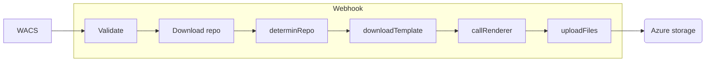
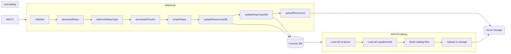

# ScriptureRenderingPipeline
A rendering pipeline for scripture and BTTWriter catalog

# Scripture rendering pipeline

```mermaid
flowchart LR;
    wacs[WACS] --> validate[Validate]
    azureStorage(Azure storage)
    subgraph webhook[Webhook]
    validate --> downloadRepo[Download repo] --> determinRepo --> downloadTemplate
    downloadTemplate --> callRenderer --> uploadFiles
    end
    uploadFiles --> azureStorage
```

# Catalog pipeline

```mermaid
flowchart LR;
    wacs[WACS] --> webhook
    azureStorage(Azure storage)
    cosmosDB[(Cosmos DB)]
    subgraph webhook [Webhook]
        validate[Validate] --> downloadRepo --> determinRepoType 
        --> downloadChunks
        --> renderRepo 
        --> updateResourcesDB
        updateResourcesDB --> updateRepoTypeDB --> uploadResources 
    end
    updateResourcesDB --> cosmosDB
    updateRepoTypeDB --> cosmosDB
    uploadResources --> azureStorage
    subgraph WACSCatalog
        wacsLoadAllScripture[Load all scripture] --> wacsLoadAllResources[Load all supplimental] 
        --> wacsBuildCatalog[Build catalog files] --> wacsUploadStorage[Upload to storage]
    end
    wacsUploadStorage --> azureStorage
    cosmosDB --> WACSCatalog
    subgraph uwCatalog
    end
```